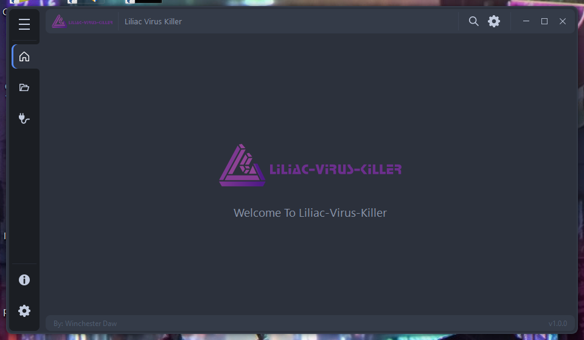
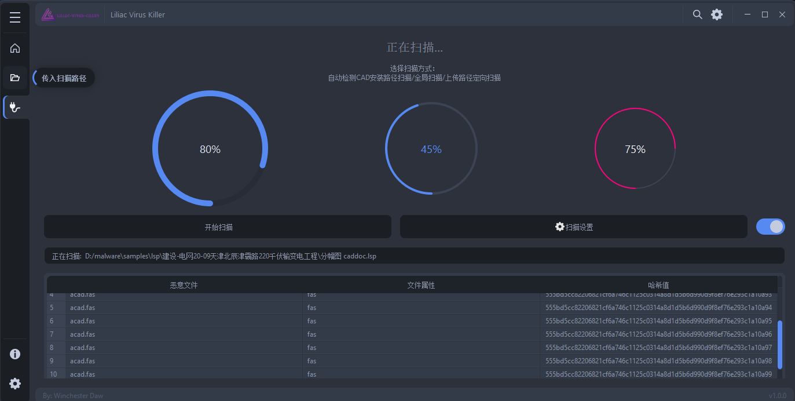

# Liliac Virus Killer
Liliac Virus Killer is an AntiMalwareTool based on PyOneDark and Yara.

本项目主要基于Yara引擎对CAD软件中的恶意脚本病毒进行检测、隔离和清除工作。

项目中包含由YarGen算法学习生成的恶意文件匹配规则，可供进行传入文件的识别。

查找到可疑文件后，会将文件进行隔离操作，可选择彻底清除或还原并移入白名单。

此项目为AutoCAD-AntiMalware的用户版本，可供外网环境使用。